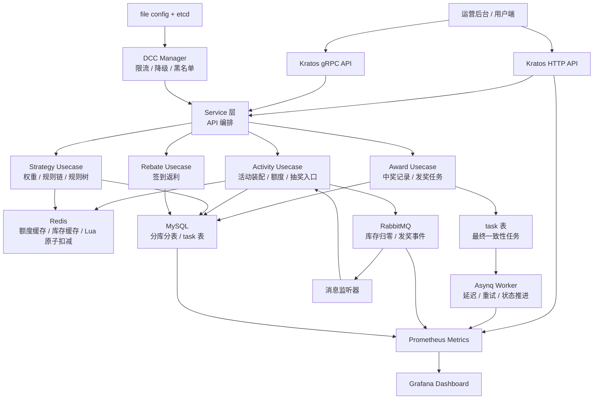
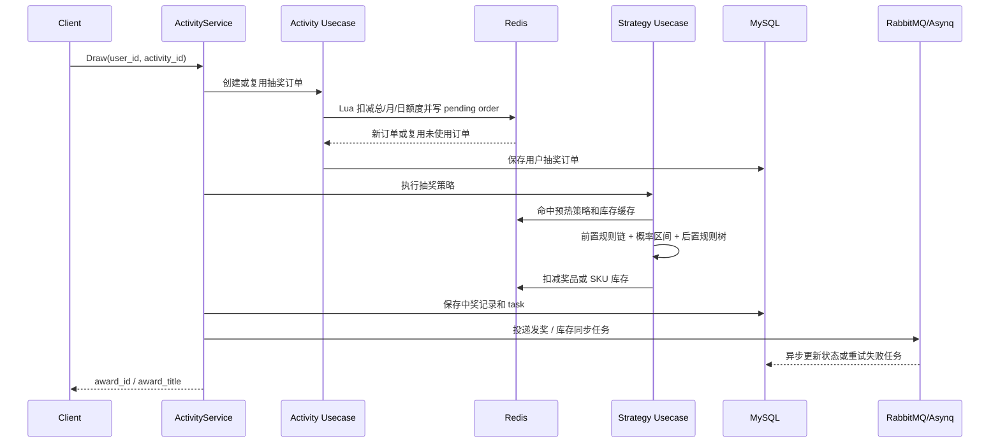

# Big Market Kratos

Big Market Kratos 是一个基于 Go Kratos 的营销活动抽奖与奖励发放系统。项目面向用户促活、签到返利、充值赠送、活动抽奖等场景，覆盖活动装配、资格校验、额度扣减、抽奖决策、库存扣减、中奖记录、异步发奖和监控告警等后端链路。

项目重点不是单纯 CRUD，而是验证高并发抽奖场景下的几个工程问题：

- 用户活动额度和 SKU 库存的原子扣减
- 抽奖策略、权重规则、规则树和兜底奖品的动态组合
- 分库分表后的用户订单、中奖记录和活动账户读写
- RabbitMQ 与 Asynq 驱动的异步结算和失败重试
- Prometheus / Grafana 对接口、业务、队列和数据库连接池的观测
- etcd + 本地 fallback snapshot 的动态配置与降级开关

## 架构图



## 核心链路



## 核心模块

| 模块 | 路径 | 职责 |
| --- | --- | --- |
| API 定义 | `api/bigmarket/v1` | 通过 proto 定义活动、策略等 HTTP/gRPC 接口 |
| 服务编排 | `internal/service` | 接收 API 请求，编排活动、策略、奖励、返利等业务用例 |
| 活动域 | `internal/biz/activity` | 活动装配、用户额度、SKU 库存、抽奖订单和状态流转 |
| 策略域 | `internal/biz/strategy` | 抽奖权重、规则链、规则树、库存规则和兜底奖品 |
| 奖励域 | `internal/biz/award` | 中奖记录、发奖 task、幂等记录 |
| 返利域 | `internal/biz/rebate` | 签到返利和行为返利 |
| 数据访问 | `internal/data` | MySQL、Redis、RabbitMQ、Asynq、分库分表路由和缓存封装 |
| 消息监听 | `internal/listener` | 消费库存归零、发奖、返利等异步消息 |
| 后台任务 | `internal/job` | Asynq 任务处理、状态重试和库存同步 |
| 动态配置 | `internal/dcc` | etcd 配置监听、本地 fallback、限流和降级配置 |
| 指标监控 | `internal/metrics` | HTTP、抽奖、库存、MQ、Asynq、MySQL 连接池等指标 |
| 服务启动 | `cmd/big-market-kratos` | Kratos 应用启动、配置加载、Wire 依赖注入 |

## 运行示例

### 1. 准备基础设施

项目依赖 MySQL、Redis、RabbitMQ、etcd；监控链路依赖 Prometheus 和 Grafana。`docker-compose.yaml` 给出了本地依赖拓扑，但密码和部分挂载文件需要按本机环境准备。

创建 `.env`：

```env
MYSQL_ROOT_PASSWORD=password
RABBITMQ_DEFAULT_PASS=password
CANAL_MYSQL_PASSWORD=password
GRAFANA_ADMIN_USER=admin
GRAFANA_ADMIN_PASSWORD=admin123456
```

启动基础依赖：

```bash
docker compose up -d mysql redis rabbitmq prometheus grafana
```

启动 etcd。当前 `cmd/big-market-kratos/main.go` 会连接 `127.0.0.1:2379` 并读取 `configs/config.yaml` 路径下的动态配置，因此本地运行前需要确保 etcd 可访问：

```bash
docker run -d --name bigmarket-etcd \
  -p 127.0.0.1:2379:2379 \
  -p 127.0.0.1:2380:2380 \
  quay.io/coreos/etcd:v3.5.15 \
  /usr/local/bin/etcd \
  --advertise-client-urls http://0.0.0.0:2379 \
  --listen-client-urls http://0.0.0.0:2379
```

如果本机没有提交 `mysql/redis/rabbitmq` 的挂载配置文件，可以改为使用已有的本地服务，并在 `configs/config.yaml` 中调整连接地址。

### 2. 准备配置

复制示例配置：

```bash
cp configs/config.example.yaml configs/config.yaml
```

重点检查：

- `data.mysql.dsn`：MySQL 用户名、密码、库名格式、分库数量和分表数量
- `data.redis`：Redis 主库，用于活动额度、库存和业务缓存
- `asynq.redis`：Asynq 独立 Redis DB
- `rabbitmq`：消息队列连接和 topic
- `data.etcd.endpoints`：etcd 配置中心地址
- `monitor`：Prometheus metrics 暴露端口和路径

### 3. 启动后端

```bash
make backend-dev
```

等价命令：

```bash
go run ./cmd/big-market-kratos -conf ./configs
```

默认服务端口：

| 服务 | 地址 |
| --- | --- |
| HTTP API | `0.0.0.0:8080` |
| gRPC API | `0.0.0.0:9000` |
| Metrics | `127.0.0.1:9091/metrics` |
| Prometheus | `http://localhost:9090` |
| Grafana | `http://localhost:3000` |

### 4. 调用示例

活动装配：

```bash
curl "http://localhost:8080/api/v1/strategy/raffle/activity/armory?activity_id=100301"
```

加载用户活动账户：

```bash
curl -X POST "http://localhost:8080/api/v1/strategy/raffle/activity/load_user_activity_account" \
  -H "Content-Type: application/json" \
  -d '{"user_id":"10001","activity_id":100301}'
```

执行抽奖：

```bash
curl -X POST "http://localhost:8080/api/v1/strategy/raffle/activity/draw" \
  -H "Content-Type: application/json" \
  -d '{"user_id":"10001","activity_id":100301}'
```

查询用户账户：

```bash
curl -X POST "http://localhost:8080/api/v1/strategy/raffle/activity/query_user_activity_account" \
  -H "Content-Type: application/json" \
  -d '{"user_id":"10001","activity_id":100301}'
```

### 5. 测试与构建

```bash
go test ./...
make build
```

生成 proto、配置和 Wire 相关代码：

```bash
make all
```

## 配置说明

| 配置项 | 说明 |
| --- | --- |
| `server.http.addr` | HTTP 服务监听地址 |
| `server.grpc.addr` | gRPC 服务监听地址 |
| `data.mysql.dsn` | MySQL DSN 模板，包含分库占位符 |
| `data.mysql.db_count` | 分库数量 |
| `data.mysql.tb_count` | 分表数量 |
| `data.redis` | 业务 Redis，用于库存、额度、缓存和 pending order |
| `asynq.redis` | Asynq 使用的 Redis 配置 |
| `asynq.concurrency` | Asynq worker 并发数 |
| `rabbitmq.topic` | 库存归零、发奖、返利等 topic 配置 |
| `dcc.rate_limit` | 动态限流阈值 |
| `dcc.enable_degrade` | 降级开关 |
| `dcc.black_list` | 黑名单配置 |
| `monitor.enable` | 是否开启 metrics 服务 |
| `monitor.addr` | metrics 服务监听地址 |
| `monitor.path` | metrics 暴露路径 |

配置来源由 `file.NewSource(flagconf)` 和 etcd source 共同组成；DCC 初始化后会将动态配置写入内存，并在异常时使用 `data/fallback_snapshot.json` 作为兜底。

## 设计取舍

### Redis Lua 保证热点链路原子性

用户额度和库存扣减都属于高并发热点路径。项目将额度检查、扣减、pending order 写入合并到 Lua 脚本中执行，避免应用层多次 Redis 往返和并发窗口问题。代价是脚本复杂度上升，需要对返回码和补偿逻辑做清晰约定。

### 订单先占用，发奖最终一致

抽奖入口优先保证用户额度、库存和订单状态不重复消费；中奖记录和发奖任务通过 task 表、RabbitMQ、Asynq 继续推进。这样可以缩短核心接口响应路径，但需要处理任务状态、重复消费、失败重试和补偿。

### 规则链 + 规则树拆分前后置逻辑

黑名单、权重等前置规则适合在抽奖前快速接管；库存、次数锁、兜底奖品等后置约束适合在奖品候选产生后通过规则树判断。拆分后业务扩展更清晰，但规则配置错误会带来运行时风险，因此代码中对规则树根节点和规则模型做了校验。

### 分库分表按用户维度路由

用户账户、抽奖订单、中奖记录等高增长表按用户维度路由，可以降低单表压力并保持同一用户相关数据局部性。代价是跨用户查询和运营聚合会变复杂，因此项目另有 CDC/ES 同步方向用于查询侧扩展。

### RabbitMQ 和 Asynq 分工

RabbitMQ 更适合跨模块事件通知，例如库存归零、发奖事件；Asynq 更适合本服务内部延迟、重试和状态推进任务。两者并存会增加运维复杂度，但可以更贴近不同异步场景。

### 指标优先控制低基数

Prometheus 指标覆盖 HTTP、抽奖结果、库存、MQ、Asynq 队列和 MySQL 连接池。标签设计避免 `user_id`、`order_id`、SQL 文本等高基数字段，优先保证监控系统稳定性。

## 压测基线

仓库中的 `PERFORMANCE_BASELINE_NO_OUTBOX.md` 记录了一次无 Outbox 链路的历史压测基线：

- 机器：单机 2C4G
- 工具：wrk
- 场景：额度和库存提前预热
- QPS：约 6000 req/s
- P99：约 62 ms
- 错误率：0%

这组数据用于说明轻链路、缓存预热场景下的吞吐上限，不应直接视为完整最终一致性链路的生产性能。

## 当前边界

- 当前仓库重点展示后端链路、并发控制、异步任务和监控能力。
- 本地一键启动依赖 MySQL 初始化 SQL、Redis/RabbitMQ 配置和环境变量，部署前需要按本机环境补齐。
- 压测数据需要结合具体分支、配置、机器和数据准备方式解读，不能脱离上下文泛化。
