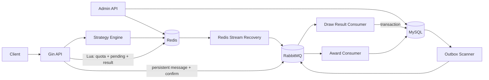

# PrizeForge

PrizeForge 是一个使用 Go 实现的营销抽奖与奖励发放系统，覆盖活动额度、抽奖策略、库存预占、结果落库、异步发奖和失败补偿等完整链路。

项目重点不在接口数量，而在高并发场景下的原子性、幂等性、最终一致性和可观测性实践。

## 核心特性

- **Redis-first 抽奖链路**：使用 Lua 原子校验并扣减用户额度，保存 pending 订单与抽奖结果。
- **可组合抽奖策略**：支持概率抽奖、权重规则、责任链、规则树和兜底奖品。
- **可靠异步落库**：Redis Stream 负责恢复依据，RabbitMQ 使用持久化消息、mandatory 路由检查和 Publisher Confirm。
- **幂等与最终一致性**：MySQL 唯一约束、Outbox、手动 ACK/Nack 和补偿任务共同避免重复订单与消息丢失。
- **分库分表**：用户订单、活动账户和中奖记录按用户维度路由。
- **工程化保障**：提供单元测试、真实依赖集成测试、CI、镜像发布、生产部署和回滚脚本。

## 架构



Redis 负责请求热路径上的原子预占和恢复记录，MySQL 保存最终订单、额度、中奖记录和任务状态。RabbitMQ 与 Asynq 负责异步投递、重试和补偿。

## 技术栈

| 类别 | 技术 |
| --- | --- |
| 服务 | Go 1.25、Gin、GORM |
| 数据 | MySQL、Redis、TinyLFU |
| 异步 | RabbitMQ、Asynq、Outbox |
| 工程 | Viper、Zap、Prometheus、Grafana |
| 扩展 | go-mysql CDC、Elasticsearch |

## 快速开始

### 环境要求

- Go 1.25+
- Docker
- Docker Compose

### 1. 启动开发依赖

集成环境会启动临时 MySQL、Redis 和 RabbitMQ，并自动导入 `docs/sql/` 中的初始化脚本：

```bash
make integration-up
```

默认连接信息：

| 服务 | 地址 | 账号 |
| --- | --- | --- |
| MySQL | `127.0.0.1:13306` | `root / prizeforge-integration` |
| Redis | `127.0.0.1:16379` | 无密码 |
| RabbitMQ | `127.0.0.1:15673` | `prizeforge-integration / prizeforge-integration` |

### 2. 准备配置

```bash
cp configs/config.example.yaml configs/config.yaml
```

将 `configs/config.yaml` 中的 MySQL、Redis、Asynq Redis 和 RabbitMQ 地址调整为上表的开发端口。生产环境可以使用 `PRIZEFORGE_` 前缀的环境变量覆盖敏感配置。

### 3. 启动服务

分别在两个终端运行：

```bash
make run-api
```

```bash
make run-admin
```

默认端口：

- API：`http://127.0.0.1:8080`
- Admin：`http://127.0.0.1:8081`

健康检查：

```bash
curl http://127.0.0.1:8080/healthz
curl http://127.0.0.1:8080/readyz
```

开发结束后销毁临时依赖：

```bash
make integration-down
```

## 测试

```bash
# 格式、静态检查、单元测试和部署脚本测试
make check

# 启动真实 MySQL、Redis、RabbitMQ，运行集成测试并自动清理
make integration-test
```

CI 会在 `main` 分支推送和 Pull Request 时自动运行检查与集成测试。

## 压测

项目提供针对抽奖接口 `POST /api/v1/raffle/activity/draw` 的专用压测程序，支持准备测试数据和执行并发压测：

```bash
go build -o ./bin/prizeforge-benchmark ./cmd/benchmark

./bin/prizeforge-benchmark prepare --help
./bin/prizeforge-benchmark run --help
```

完整用法见 [压测工具说明](cmd/benchmark/README.md)。

## 部署

- 推送 `v*` 标签后，GitHub Actions 会运行检查、集成测试并构建 API/Admin 镜像。
- `.github/workflows/deploy-production.yml` 支持手动选择镜像版本部署。
- `deploy/deploy.sh` 会预拉取镜像、更新服务、检查 `/healthz` 与 `/readyz`，失败时自动回滚应用版本。
- 生产 Compose、配置模板和部署脚本位于 [`deploy/`](deploy/)。

## 项目结构

```text
cmd/                    服务与压测程序入口
internal/application/   应用编排
internal/domain/        活动、策略、奖励、返利、任务领域
internal/infrastructure/数据库、缓存、消息队列与仓储实现
internal/listener/      RabbitMQ 消费者
internal/job/           Asynq 与补偿任务
server/http/            Gin 路由和 Handler
pkg/                    通用配置、日志、缓存和事件组件
tests/integration/      真实依赖集成测试
deploy/                 生产 Compose 与部署脚本
docs/                   数据库脚本和工程问题记录
```

## 相关文档

- [工程问题与解决记录](docs/problem_records.md)
- [压测工具说明](cmd/benchmark/README.md)
- [数据库初始化脚本](docs/sql/)
