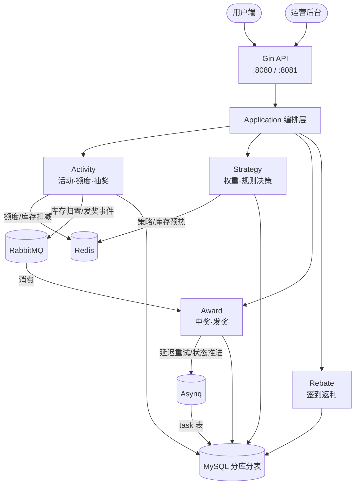
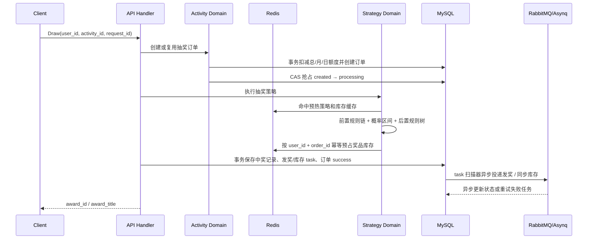

# PrizeForge

PrizeForge 是一个基于 Go Gin 的营销抽奖与奖励发放系统。面向用户促活、签到返利、活动抽奖等场景，覆盖活动装配、资格校验、额度扣减、抽奖决策、库存扣减、中奖记录、异步发奖和监控告警等后端链路。

重点解决：

- 用户活动额度和 SKU 库存的原子扣减（Redis Lua）
- 抽奖策略、权重规则、规则树和兜底奖品的动态组合（责任链 + 决策树）
- 分库分表后的用户订单、中奖记录和活动账户读写
- RabbitMQ 与 Asynq 驱动的异步结算和失败重试
- Prometheus / Grafana 对接口、业务、队列和数据库连接池的观测
- Viper 本地配置热更新

## 架构图



## 核心链路



## 目录结构

```
prizeforge/
├── cmd/
│   ├── api/main.go              # 用户端 HTTP 服务入口
│   ├── admin/main.go            # 运营后台 HTTP 服务入口
│   └── cdc-sync/main.go         # CDC 同步服务入口
├── configs/
│   └── config.yaml              # 应用配置（Viper 热更新）
├── internal/
│   ├── domain/                  # 领域层（核心业务逻辑，框架无关）
│   │   ├── activity/            # 活动、额度、库存、订单
│   │   ├── award/               # 中奖记录、发奖任务
│   │   ├── rebate/              # 签到返利、行为返利
│   │   ├── strategy/            # 抽奖权重、规则链、规则树
│   │   └── task/                # 任务调度
│   ├── application/             # 应用层（薄编排，调用 domain）
│   │   ├── api/                 # 用户端用例
│   │   └── admin/               # 管理端用例
│   ├── infrastructure/          # 基础设施层
│   │   ├── adapter/             # MySQL、Redis、RabbitMQ、Asynq 适配器
│   │   ├── dbutil/              # 数据库工具
│   │   └── repository/          # 仓储实现（GORM、缓存、分库分表路由）
│   │       ├── activityrepo/    # 活动仓储实现（package 名带 repo 后缀，避免与 domain/activity 重名）
│   │       ├── awardrepo/
│   │       ├── rebaterepo/
│   │       ├── strategyrepo/
│   │       ├── taskrepo/
│   │       └── po/              # GORM 持久化对象（PO）
│   ├── bootstrap/               # 依赖注入（组合根，区分 NewAPIApp / NewAdminApp）
│   ├── cdc/                     # CDC 变更数据捕获（MySQL → ES，走环境变量配置）
│   ├── job/                     # Asynq 任务处理器（sku 库存消费 / 发奖分发 / 策略奖品库存消费）
│   ├── listener/                # RabbitMQ 消费者与监听器（库存归零 / 返利发奖 / 订单持久化）
│   ├── metrics/                 # Prometheus 指标定义
│   ├── middleware/              # HTTP 中间件（CORS、Prometheus、Auth、Degrade、RateLimiter）
│   ├── shared/xerr/             # 统一错误定义
│   └── worker/                  # Asynq 后台 worker
├── server/
│   └── http/                    # Gin HTTP 路由与处理器
│       ├── api/                 # 用户端路由
│       ├── admin/               # 管理端路由
│       └── common/              # 中间件、请求/响应封装
├── pkg/                         # 公共工具库
│   ├── cache/                   # 缓存接口 + TinyLFU 本地缓存
│   ├── config/                  # Viper 配置加载
│   ├── logger/                  # Zap 日志
│   ├── rabbitmq/                # RabbitMQ 事件封装
│   └── xrand/                   # 安全随机数
├── monitoring/                  # Grafana Dashboard + Prometheus 配置
└── docker-compose.yaml
```

### 进程模型与配置说明

- `cmd/api`：HTTP 服务 + Asynq worker + RabbitMQ consumer 一体进程（`bootstrap.NewAPIApp`）。需要 RabbitMQ 和 Asynq Redis 可达；RabbitMQ 连接失败时直接 fatal。
- `cmd/admin`：仅 admin HTTP 服务（`bootstrap.NewAdminApp`），不建 RabbitMQ 连接、不启动 worker/consumer，可在无 RabbitMQ 的轻量环境启动。
- `cmd/cdc-sync`：独立的 CDC sidecar，配置走**环境变量**（`cdc.LoadConfigFromEnv`，`CDC_*` 前缀），不依赖 `configs/config.yaml` 和 Viper，可单独部署，请勿改回 viper。

## 快速开始

### 1. 启动基础设施

```bash
docker compose up -d mysql redis rabbitmq prometheus grafana
```

### 2. 准备配置

```bash
cp configs/config.example.yaml configs/config.yaml
```

重点检查：
- `data.database`：MySQL 分库分表配置
- `data.redis`：Redis 连接（业务缓存 + 额度/库存）
- `asynq`：Asynq 独立 Redis 配置
- `rabbitmq`：消息队列连接和 topic
- `server.http.addr` / `server.admin.addr`：服务监听地址

### 3. 启动应用

```bash
# 启动 API 服务（用户端）
go run ./cmd/api/

# 启动 Admin 服务（管理端）
go run ./cmd/admin/

# 启动 CDC 同步服务
go run ./cmd/cdc-sync/
```

### 4. 服务端口

| 服务 | 地址 |
| --- | --- |
| API HTTP | `0.0.0.0:8080` |
| Admin HTTP | `0.0.0.0:8081` |
| Metrics | `127.0.0.1:9091/metrics` |
| Prometheus | `http://localhost:9090` |
| Grafana | `http://localhost:3000` |

### 5. 接口示例

活动装配（预热策略到缓存）：

```bash
curl "http://localhost:8080/api/v1/raffle/strategy/armory?strategy_id=100001"
```

执行抽奖：

```bash
curl -X POST "http://localhost:8080/api/v1/raffle/activity/draw" \
  -H "Content-Type: application/json" \
  -d '{"user_id":"10001","activity_id":100301,"request_id":"01K0DRAWEXAMPLE000000000001"}'
```

查询用户活动账户：

```bash
curl -X POST "http://localhost:8080/api/v1/raffle/activity/query_user_activity_account" \
  -H "Content-Type: application/json" \
  -d '{"user_id":"10001","activity_id":100301}'
```

签到返利：

```bash
curl -X POST "http://localhost:8080/api/v1/raffle/activity/calendar_sign_rebate" \
  -H "Content-Type: application/json" \
  -d '{"user_id":"10001"}'
```

## 设计取舍

### MySQL 订单真相源，Redis 承担热点策略和库存

用户额度与抽奖订单在同一个 MySQL 事务内提交，保证失败可恢复；Redis Lua 负责奖品库存预占，并以 `user_id + order_id` 做幂等。Redis 丢失只影响热点能力，不改变订单和中奖结果的最终真相。

### 订单先占用，发奖最终一致

接口同步完成两次事务：第一次扣额度并创建订单，第二次保存中奖结果、发奖 task、库存同步 task 和成功状态。实际发奖、数据库库存同步通过 task 表、RabbitMQ、Asynq 异步推进。

### 规则链 + 规则树拆分前后置逻辑

黑名单、权重等前置规则适合在抽奖前快速接管；库存、次数锁、兜底奖品等后置约束适合在奖品候选产生后通过规则树判断。代码中对规则树根节点和规则模型做了校验，防止配置错误导致运行时异常。

### 分库分表按用户维度路由

用户账户、抽奖订单、中奖记录等高增长表按用户维度路由，降低单表压力并保持同一用户相关数据局部性。跨用户查询和运营聚合可通过 CDC/ES 同步方向扩展。

### RabbitMQ 和 Asynq 分工

RabbitMQ 适合跨模块事件通知，例如库存归零、发奖事件；Asynq 适合本服务内部延迟、重试和状态推进任务。两者并存增加运维复杂度，但可以更贴近不同异步场景。

### 指标优先控制低基数

Prometheus 指标覆盖 HTTP、抽奖结果、库存、MQ、Asynq 队列和 MySQL 连接池。标签设计避免 `user_id`、`order_id` 等高基数字段，优先保证监控系统稳定性。

## 压测基线

仓库中的 `PERFORMANCE_BASELINE_NO_OUTBOX.md` 记录了单次历史压测基线：

- 机器：单机 2C4G
- 工具：wrk
- 场景：额度和库存提前预热
- QPS：约 6000 req/s
- P99：约 62 ms
- 错误率：0%

这组数据用于说明轻链路、缓存预热场景下的吞吐上限，不应视为完整最终一致性链路的生产性能。

## 技术栈

| 类别 | 选型 |
| --- | --- |
| Web 框架 | Gin |
| ORM | GORM |
| 缓存 | Redis + TinyLFU |
| 消息队列 | RabbitMQ |
| 任务队列 | Asynq |
| 日志 | Zap + Lumberjack |
| 配置 | Viper（文件热更新） |
| 监控 | Prometheus + Grafana |
| 数据库 | MySQL（分库分表） |
| CDC | go-mysql → Elasticsearch |
